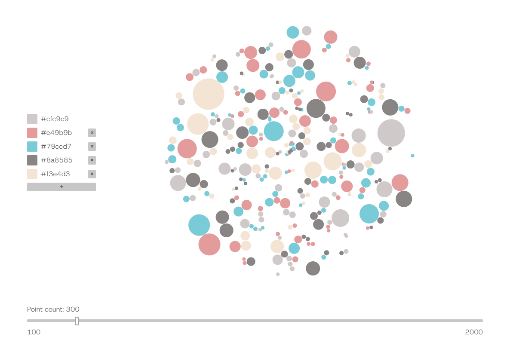

# Palette Creator (MVPOC)

- **Step 1:** Add colours
- **Step 2:** Adjust point count

## Possible future features

- Other visualisation modes (bin packing, gradients...)
- Improve the circle packing algo perhaps
- Export in hex, RGB, 0 - 1 range palettes
- Color space adjustment
- 'Generate palette' option
- Saving snapshots / naming palettes
